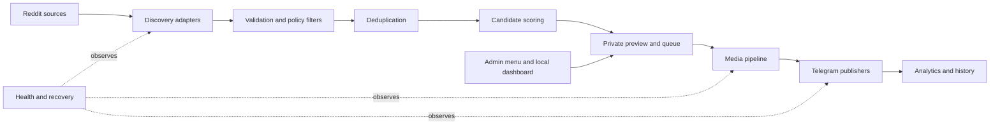

# Architecture

## Design boundaries

- Each bot profile owns its source rules, schedule, destination, captions, and state.
- Discovery does not imply approval or publication.
- Deduplication happens before expensive media work.
- Media validation and conversion are isolated from editorial policy.
- A successful Telegram result is required before history is committed.
- Admin actions are accepted only from configured identities.

## Operational model

Health checks summarize source access, Telegram access, configuration, media tools, queue state, and recent outcomes. Recovery can retry transient failures, transform oversized media, or release a stuck preview. Emergency thresholds can pause publishing for operator review.

Implementation details are available in `src/`. Runtime credentials, state,
traffic data, logs, downloaded media, and backups remain local and are not
tracked by Git.
